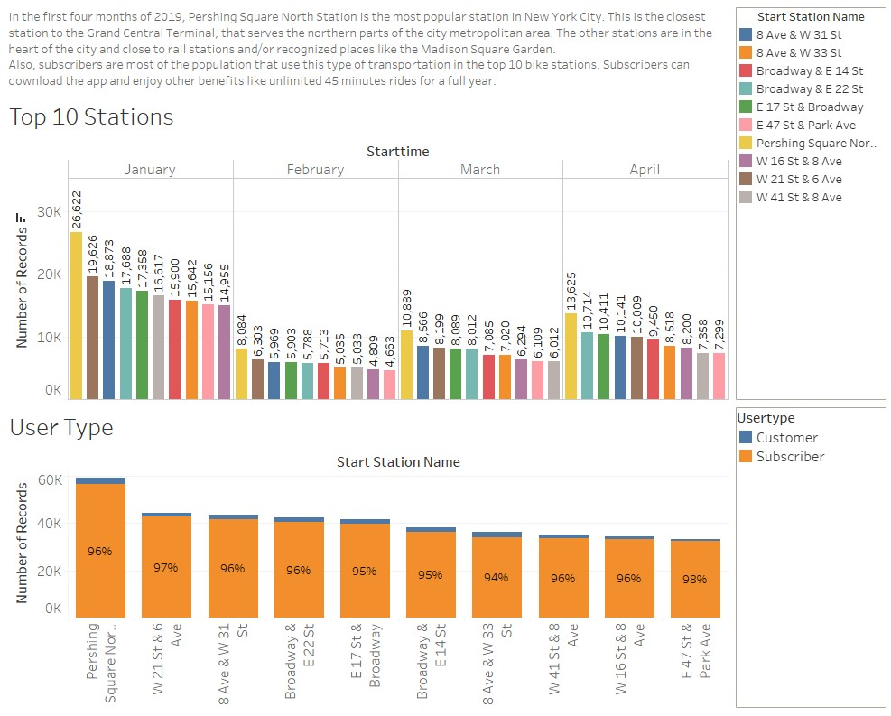
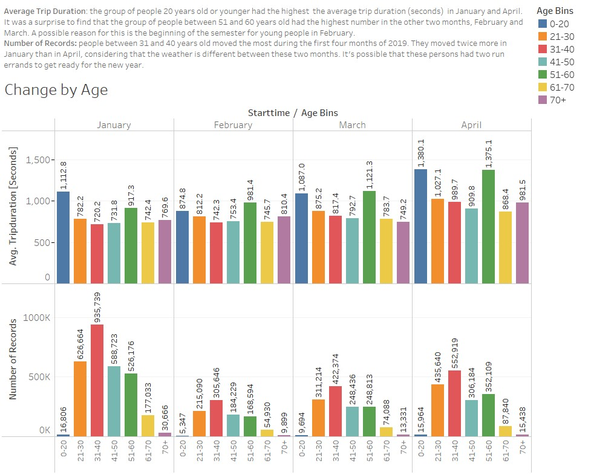

# Tableau-CitiBike

## Citi Bike Analytics

The task in this assignment is to aggregate the data found in the Citi Bike History Logs. Then, to build a data dashboard that can answer the following questions:

- What are the bottom 10 stations in the city for starting a journey? (Based on data, why?)

- How has the proportion of short-term customers and annual subscribers changed?

- How does the average trip duration change by age?

